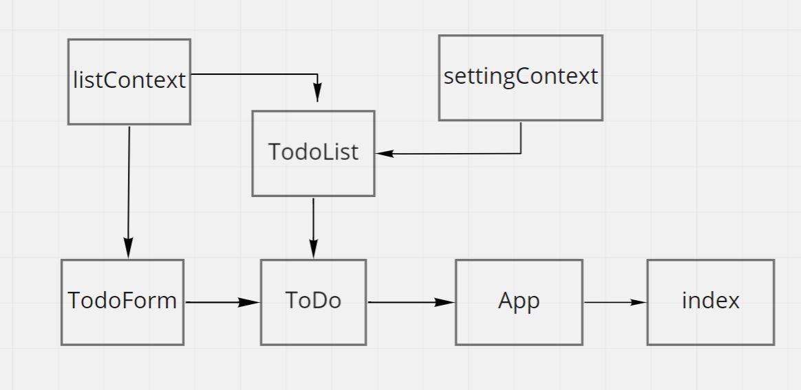

# LAB - Context API

## Description

**Based on global configuration**

- Show a maximum of a certain number of items per screen in the List component

- Provide “next” and “previous” links to let the users navigate a long list of items

- Hide or show completed items in the list

- Optional: Sort the items based on any of the keys (i.e. difficulty)

**Implement this using context**

- Create a context for managing application display settings and provide this at the application level

- Display or Hide completed items (boolean)

- Number of items to display per screen (number)

- Default sort field (string)

- Manually set (hard code) those state settings in the context provider’s state, they should not be changeable

## Links

  Sandbox Deployment Link: 

  Pull Request: 

## UML

